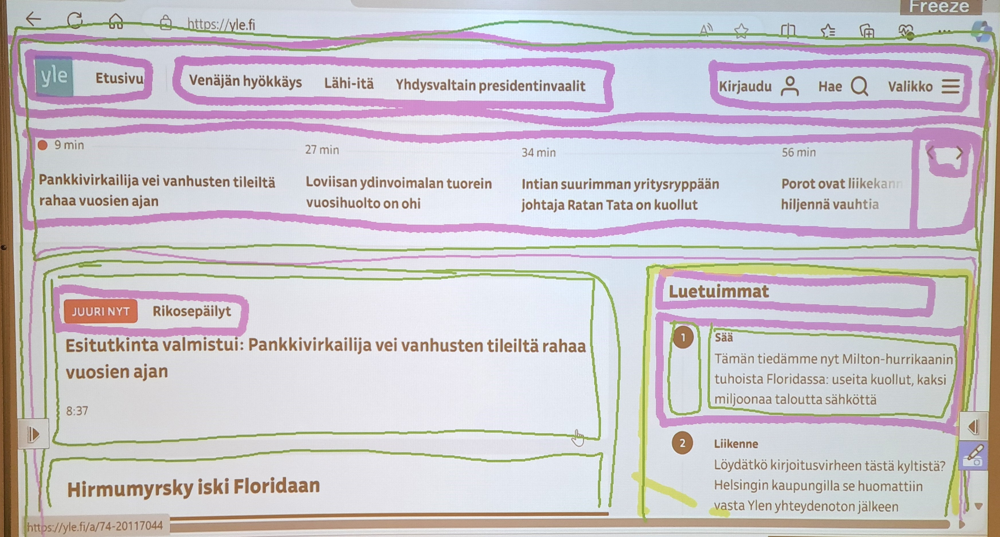
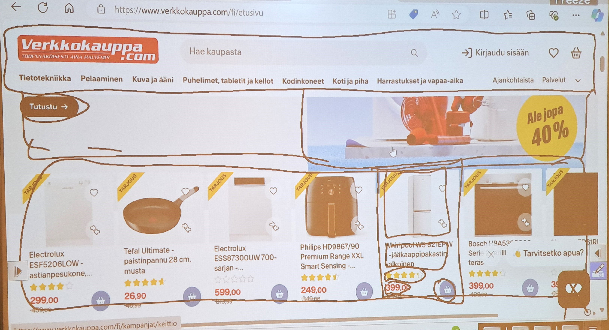
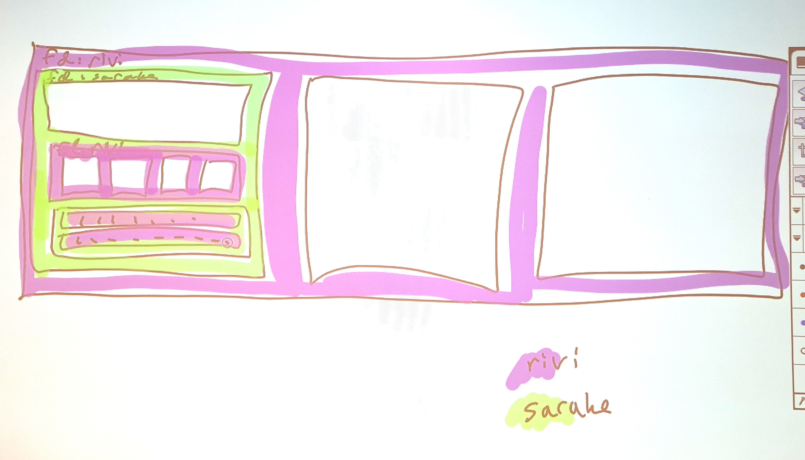

# Sivu flexbox:ia käyttäen ja värjäten rivejä ja sarakkeita

## Tehtävä lyhyesti

Toteutetaan wireframe-versio verkkokauppa.com:in etusivusta siten, että:

* käytetään osien järjestelemiseen css:n `flexbox`-sääntöjä.
* värjätään elementit violetilla, joissa käytetään `flex-direction: row;` -sääntöä.
* värjätään elementit vihreällä, joissa käytetään `flex-direction: column;` -sääntöä.

Tehdään siis oheista muistuttava sivu, mutta käsivaraisen värjäyksen sijaan, tehdään värjäys html:llä ja css:llä.

## Tehtävä

### Kuvakaappaus referenssisivusta

Ota [verkkokauppa.com](https://verkkokauppa.com) -sivuston etusivusta kuvakaappaus siten, että kuvassa näkyy sivun yläpalkki ja horisontaalinen tuote-esittelyosio alla olevan kuvan mukaisesti.

Tallenna tämä referenssikuva samaan kansioon tämän tehtävän html- ja css-tiedostojen kanssa.

### Wireframe-sivu

Tässä tehtävässä tehdyn sivun ei tarvitse muistuttaa suoraan referenssikuvaa, vaan tuottaa verkkokauppa.com:in etusivua mallintava sivu, jossa sivun elementit on värjätty kahdella värillä, sen mukaan ovatko elementin lapsielementit järjestetty riviin vai sarakkeeseen.

#### käyttäen `flexbox`-sääntöjä

Tee sivu käyttäen `flexbox`-css-sääntöjä:

* merkitse lapsielementtejä sisältävät elementit `display: flex` -säännöllä
* määritä elementeille joko `flex-direction: row` tai `flex-direction: column`

#### värjäten elementtejä violetiksi ja vihreäksi

Jokaisella elementillä, jolla on lapsielementtejä, pitäisi päteä seuraavat asiat:

* värjää elementit, joihin on asetettu `flex-direction: row` violetiksi: `background-color: violet`.
* värjää elementit, joihin on asetettu `flex-direction: column` vihreäksi: `background-color: green`.
* lisää näille elementeille musta reunus: `border: solid 1px black`.
* lisää näille elementeille padding, jotta lapsielementtien värit eivät peitä tämän elementin taustaväriä: `padding: 14px`.
